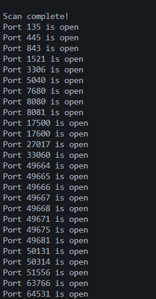

# **Rust Multi-threaded Port Scanner**

# Rust Port Scanner

This is a simple **port scanner** written in Rust that scans an IP address to check for open ports. It supports multi-threading for faster scanning.

## Features
- Scan all **65,535** ports of an IP address.
- Multi-threading support for faster scanning.
- Command-line argument parsing.
- Display open ports in real-time.

## Installation
Ensure you have **Rust** and **Cargo** installed.

Clone the repository:
```sh
git clone <repo-url>
cd <repo-folder>
```

Build the project:
```sh
cargo build --release
```

## Usage
Run the program using `cargo run -- <arguments>`:

### Scan an IP address:
```sh
cargo run -- 192.168.1.1
```

### Scan using multiple threads:
```sh
cargo run -- -j 100 192.168.1.1
```
(Uses 100 threads for scanning)

### Display help message:
```sh
cargo run -- -h
```

## Example Output
```
Scanning 192.168.1.1...
.
.
.
80 is open
443 is open
```

#### **Example Usage:**  



## **📌 Project Overview**  
This is a **multi-threaded port scanner** written in **Rust**. It efficiently scans a target **IP address** for open ports, leveraging concurrency to speed up the process. The scanner supports:

✅ **Default scanning** (4 threads)  
✅ **Custom thread selection** (via `-j <num_threads> <IP>`)  
✅ **Real-time output** showing open ports  
✅ **Graceful error handling** for invalid inputs  

This tool is useful for **network administrators, security professionals, and developers** who need to quickly check which ports are accessible on a given system.

---

## **🔧 Features & Functionality**
### **1️⃣ Multi-threaded Scanning**
- Uses **Rust’s threading capabilities** to divide the workload among multiple threads.  
- Each thread scans ports in increments to prevent overlap.  
- Open ports are detected and stored for final output.  

### **2️⃣ Efficient Port Checking**
- Attempts to establish a **TCP connection** with each port using `TcpStream::connect()`.  
- If a connection is successful, the port is considered **open** and displayed in the results.  

### **3️⃣ Command-Line Interface (CLI)**
The program can be executed using different options:

| Command | Description |
|---------|------------|
| `ip_snipper.exe <IP>` | Scans with **default 4 threads** |
| `ip_snipper.exe -j <num_threads> <IP>` | Scans with a **custom number of threads** |
| `ip_snipper.exe -h` or `-help` | Displays usage instructions |


## **🛠️ How It Works**
1. **Argument Parsing:**  
   - The program extracts user input (`IP address`, `threads`, `flags`).  
   - If an invalid argument is provided, an error message is displayed.  

2. **Threading Setup:**  
   - Creates multiple threads, each assigned a range of ports.  
   - Uses Rust’s **MPSC (multi-producer, single-consumer) channel** to collect results from threads.  

3. **Scanning Process:**  
   - Each thread attempts to connect to ports on the target IP.  
   - Open ports are recorded and displayed in real-time.  

4. **Final Output:**  
   - Once all threads finish, the results are sorted and displayed.  
   - The program prints all **open ports** found.  

---

## **📂 Project Structure**
```
📦 rust-port-scanner
 ├── src
 │   ├── main.rs  # Main executable logic
 ├── Cargo.toml   # Dependencies & build config
 ├── README.md    # Documentation
```

---

## **🚀 Why Use This Scanner?**
✅ **Fast:** Uses multi-threading to scan thousands of ports quickly.  
✅ **Lightweight:** Minimal dependencies, runs efficiently on any system.  
✅ **Safe & Secure:** Built with Rust’s memory safety and concurrency features.  
✅ **Customizable:** Choose thread count for optimal performance.  

---

## **👨‍💻 Future Improvements**
🔹 Add **UDP scanning** support  
🔹 Implement **timeout handling** for unresponsive ports  
🔹 Support **range-based scanning** (e.g., `1-1000` instead of `1-65535`)  
🔹 Improve **reporting/logging** with timestamps and summaries  

---

